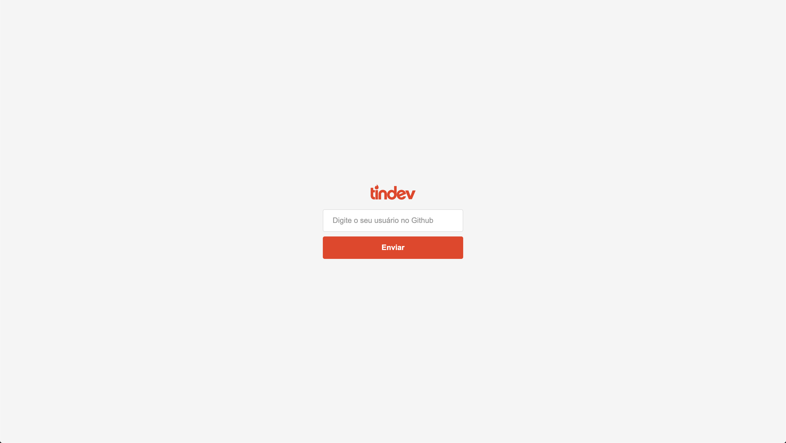
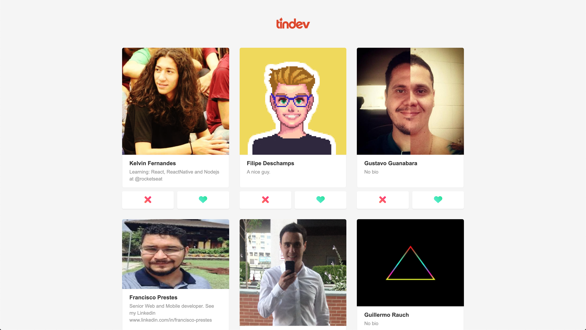

[![LinkedIn][linkedin-shield]][linkedin-url]

<br />
<p align="center">
  

  <h3 align="center">Tindev | Frontend</h3>

  <p align="center">
    A tinder for developers
    <br />
  </p>
</p>

## Table of Contents

- [About the Project](#about-the-project)
  - [Built With](#built-with)
- [Getting Started](#getting-started)
  - [Prerequisites](#prerequisites)
  - [Installation](#installation)
- [Usage](#usage)
- [Contact](#contact)
- [Acknowledgements](#acknowledgements)

## About The Project





It's simple. You'll enter your github username, after that you'll see the others users and can :thumbsup: or :thumbsdown: them. If another user likes you and you likes him, it will show a "It's a match!" :smile:

This project came from a week offered by @rocketseat, where we have a little introduction to these following technologies: NodeJS, ReactJS and React Native.

### Built With

- [ReactJS](https://reactjs.org)

## Getting Started

To get this project running locally, follow these simple steps below.

### Prerequisites

- [yarn](https://yarnpkg.com/en/docs/install)

### Installation

1. Clone the repo

```sh
git clone https://github.com/kelvin-fernandes/omnistack8-frontend.git
```

3. Install dependencies packages

```sh
yarn
```

## Usage

To run locally just do it

```sh
yarn start
```

This project has a backend and mobile app too. So, to get a full experience, clone
the following repos and get the README to have all things running.

[Tindev | Backend](https://github.com/kelvin-fernandes/omnistack8-backend)

[Tindev | App](https://github.com/kelvin-fernandes/omnistack8-app)

<!-- CONTACT -->

## Contact

Kelvin Fernandes - [@i4kelvin](https://instagram.com/i4mkelvin) - sokelvinfernandes@gmail.com

Project Link: [https://github.com/kelvin-fernandes/omnistack8-frontend](https://github.com/kelvin-fernandes/omnistack8-frontend)

## Acknowledgements

- [Axios](https://github.com/axios/axios)

[linkedin-shield]: https://img.shields.io/badge/-LinkedIn-black.svg?style=flat-square&logo=linkedin&colorB=555
[linkedin-url]: https://linkedin.com/in/kelvin-fernandes
